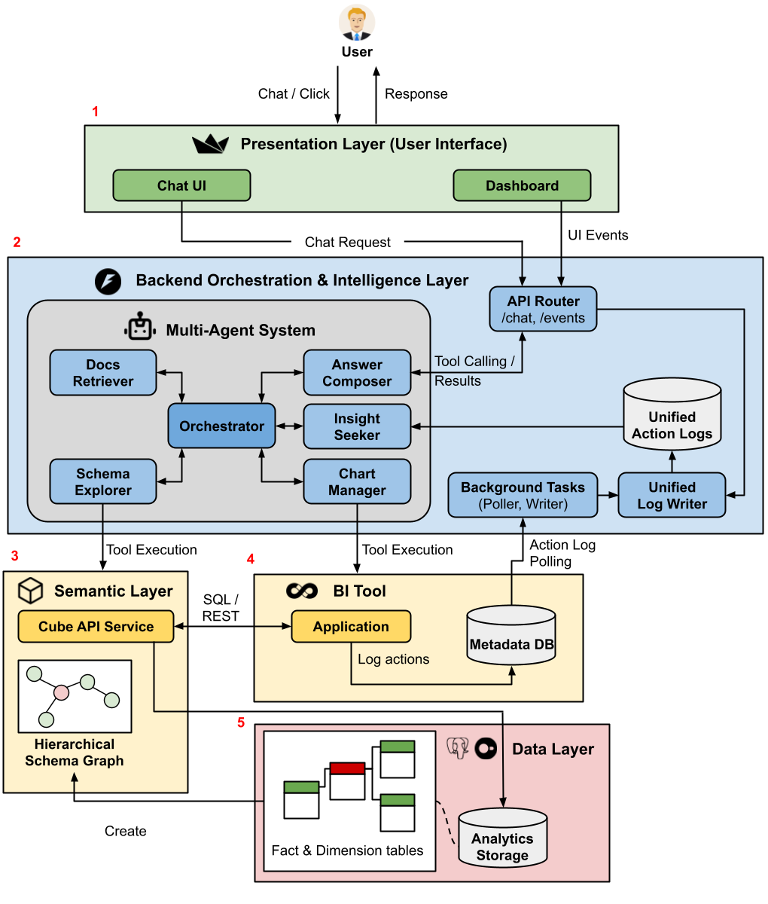

# TwinBI 🐝: An Agentic Digital Twin for Efficient Augmented Interactions with Business Intelligence Dashboards

## Overview

**TwinBI 🐝** is a research prototype for studying agentic interaction with business intelligence dashboards. It combines dashboard manipulation, contextual memory, and augmented chat-based reasoning to help an agent solve analytical tasks more effectively than a dashboard-only baseline.

The first goal of the project is to develop a Digital Twin system that fuses a Chat Interface with Business Intelligence dashboards, so that analytical interaction is not limited to direct widget manipulation alone.

The second goal is framed as a research question:

Can an augmented BI interface reduce brittle dashboard interaction and improve task completion on realistic analytical queries?

TwinBI supports two main operating settings:
- a dashboard-only agent that works directly on a Superset dashboard through screenshot- and DOM-grounded actions
- an augmented TwinBI setting that uses a Streamlit application with an embedded dashboard and chat interface for synthesis and guidance

## What This Project Does

TwinBI provides an environment for:
- creating business intelligence benchmark tasks
- running browser-based agents over dashboards
- combining dashboard context with chat-based reasoning
- tracing actions, screenshots, and memory across runs
- comparing different interface settings through controlled A/B experiments

In practice, the repository includes:
- a synthetic sales dataset and semantic layer setup
- Superset dashboards for BI interaction
- a FastAPI backend for orchestration and chat
- a Streamlit application that embeds dashboards and exposes the TwinBI interface
- experimental runners for dashboard-only and augmented settings
- benchmark queries, gold answers, and evaluation scripts

## Architecture



TwinBI follows a five-layer architecture:
- `Presentation Layer`: combines a chat interface with embedded BI dashboards so users can switch between natural-language interaction and direct visual manipulation.
- `Orchestration Layer`: manages the agent system, tool routing, and unified analytical context by combining dialogue history, dashboard logs, and tool outputs.
- `Semantic Layer`: defines measures, dimensions, hierarchies, and valid join paths so both conversational and dashboard interactions share the same business semantics.
- `BI Tool Layer`: uses Apache Superset as the executable dashboard environment and replays chart queries through tool APIs when context-grounded answers are needed.
- `Data Layer`: stores analytical data in DuckDB and exposes it only through the semantic layer to preserve consistent metric definitions and aggregation behavior.

## Main Components

### Data and schema

- [`data/`](data): generated datasets, database files, and Cube configuration
- [`src/create_db_data.py`](src/create_db_data.py): synthetic data generation
- [`src/schema_processor.py`](src/schema_processor.py): schema graph generation
- [`src/hierarchy_duckdb.py`](src/hierarchy_duckdb.py): hierarchy construction

### Services

- [`superset/`](superset): Superset source checkout
- [`fastapi/`](fastapi): backend APIs and orchestration logic
- [`streamlit-app/`](streamlit-app): Streamlit frontend with embedded dashboard support

### Experiments

- [`experiments/`](experiments): benchmark queries, gold answers, runners, and experiment documentation
- [`simulation/`](simulation): legacy and active simulation scripts, traces, and comparison outputs

## Project Guide

The project can be understood as the following pipeline:

1. Generate or load a BI dataset
2. Expose the data through Cube and Superset
3. Build dashboards for analytical interaction
4. Run either:
   - a dashboard-only agent
   - or the TwinBI augmented interface
5. Record traces, screenshots, and answers
6. Compare results against gold answers

This makes the repository useful for:
- agent evaluation
- interaction design experiments
- prompt and policy tuning
- failure analysis on dashboard tasks

For the experiment-specific guide, see:
- [`experiments/README.md`](experiments/README.md)

## System Architecture

At a high level:

- `sales.db` or other generated data acts as the analytical backend
- Cube provides a semantic/query layer over the data
- Superset provides dashboard authoring and dashboard execution
- FastAPI provides orchestration, APIs, and chat-related backend logic
- Streamlit provides the TwinBI user interface with embedded dashboards
- Playwright-based runners automate benchmark execution for evaluation

## How to Start

### Prerequisites

```text
python3.12
uv
duckdb
docker
docker-compose
```

### Setup: create Docker network

```bash
docker network create agent4olap_net
```

### Setup: sales DB and Cube.js

```bash
uv venv
source .venv/bin/activate
uv sync
echo -e "UID=$UID\nGID=$GID\nCUBEJS_TESSERACT_SQL_PLANNER=true" > .env
uv run src/create_db_data.py --type sales --rows 5000 --db_path "data/sales/database/sales.db"
```

### Setup: Superset

Clone and set up Superset:

```bash
git clone --depth=1 https://github.com/apache/superset.git superset
cd superset
git fetch --tags --depth=1
git checkout 6.0.0
```

Modify `superset/docker/pythonpath_dev/superset_config.py` and add:

```python
FEATURE_FLAGS = {"ALERT_REPORTS": True, "DRILL_BY": True, "EMBEDDED_SUPERSET": True}

TALISMAN_ENABLED = False
GUEST_TOKEN_JWT_AUDIENCE = "superset"
GUEST_TOKEN_HEADER_NAME = "X-GuestToken"
GUEST_ROLE_NAME = "Gamma"
GUEST_TOKEN_JWT_ALGO = "HS256"
GUEST_TOKEN_JWT_SECRET = "ifJCllwMr-7vPky1kysSn1qRWjgYVKt-SAZt2edE9je5fob5MKKp0yWZJ0o41h2nAjpyjAC6vH30g_qL4iCBEA"
GUEST_TOKEN_JWT_EXP_SECONDS = 3600
OVERRIDE_HTTP_HEADERS = {
    "X-Frame-Options": "ALLOWALL",
}
```

Start Superset:

```bash
cp ../docker-compose.superset.yml ./docker-compose.superset.yml
docker-compose -f ./docker-compose.superset.yml up -d
```

### Setup: sales services and schema artifacts

```bash
uv run src/create_db_data.py --type sales --rows 5000 --db_path "data/sales/database/sales.db"
docker-compose -f ./docker-compose.sales.yml up -d --build

uv run src/schema_processor.py --db_type sales --create_graphs
uv run src/hierarchy_duckdb.py --db_type sales
```

In the Superset web UI at [http://localhost:8088](http://localhost:8088), create a database connection for the generated sales DB:

```text
Host: host.docker.internal
Port: 35432
Database name: sales
Username: admin
Password: admin
Name: Sales-DuckDB
```

Then create a dashboard and enable embedding:

```text
In the dashboard, click '...' -> Embed Dashboard -> Enable Dashboard Embedding -> copy the UUID
```

Also update the `Gamma` role to include required permissions, including dataset and Sales-DuckDB related permissions.

### Setup: FastAPI and Streamlit

Configure API keys in `.env`:

```bash
OPENAI_API_KEY=your_openai_api_key
```

Run FastAPI:

```bash
docker-compose -f ./docker-compose.fastapi.yml up -d --build
```

Run Streamlit:

```bash
docker-compose -f ./docker-compose.streamlit.yml up -d --build
```

Or run the full stack:

```bash
docker compose -f docker-compose.sales.yml -f docker-compose.streamlit.yml -f docker-compose.fastapi.yml up -d --build
```

## Running Experiments

Experiment assets and instructions live under:
- [`experiments/`](experiments)

Start there for:
- benchmark queries
- answer files
- batch runners
- experiment README and project guide

## Development Notes

### Apply `superset-frontend` changes

```bash
cd superset/superset-frontend
npm ci
npm run build

cd ..
docker compose -f docker-compose.superset.yml up -d --build
```

### Apply `superset_embed_component` changes

```bash
cd streamlit-app/superset_embed_component/frontend
npm install
npm run build
```

### Reset Superset logs

```bash
docker exec -it superset_db psql -U superset -d superset
```

```sql
TRUNCATE TABLE logs RESTART IDENTITY;
```
